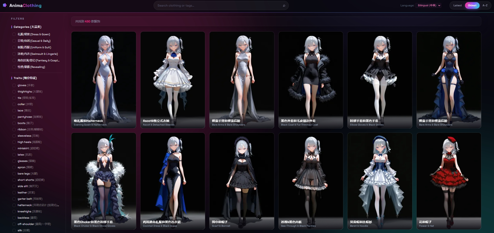

# AnimaClothing

> 访问链接：[www.animaclothing.nnegret.com](https://animaclothing.nnegret.com/)
>
> 项目预览图：
> 

---

### 致敬与数据来源
本项目的大部分数据资源致敬并来源于开源项目 **[Dressing-doll](https://github.com/1nten/Dressing-doll/tree/main)** 及其开源作者 **[1nten](https://github.com/1nten)**。

---

### 网站用途
这是一个专门用于**浏览、筛选和生成 AI 绘画二次元服装 Prompt 提示词**的视觉画廊与选择器。旨在帮助用户快速选定心仪的服装搭配，并一键获取精准的提示词，以便直接应用于 ComfyUI、WebUI 等 AI 绘画生成工具中。

---

### 核心功能
*   **中英双语搜索**：支持使用中文或英文关键字对服装名称、Prompt 标签及服装编号进行快速联合检索。
*   **中英双语/纯英文实时切换**：顶部导航栏配有语言选择器（Language），支持一键在“中英双语对照 (Bilingual)”与“仅英文 (English)”之间进行整站渲染切换（包括大分类、细分特征、已选标签、服装名称及 Prompt 浮层）。
*   **全幅无裁剪大图卡片**：还原了 512:768 (2:3) 黄金画幅比，服装信息名字区以暗黑半透明渐变（Linear Gradient）形式悬浮于大图底部。
*   **磨砂玻璃悬浮遮罩 (Glassmorphism)**：鼠标滑过卡片时，底部的名字会以 0.25s 动画平滑淡出，同时卡片背景触发磨砂模糊，凸现 Prompt 标签页。
*   **标题一键复制与小 Tag 单击复制**：
    *   直接点击悬浮层顶部的 `Prompt Tags (复制/Copy)` 标题胶囊条，即可一键复制整套英文 Prompt。
    *   支持点击小 Tag 标签直接复制纯英文（例如点击 `high heels (高跟鞋)` 药丸，只会复制 `high heels`），提高提示词获取效率。
*   **霓虹粉色发光已选标签**：已选面包屑 Chips 呈现精致的霓虹粉色发光药丸形状。
*   **细分特征直观展示**：左侧 Traits 细分特征列表完整平铺展开，极易查阅和勾选。
